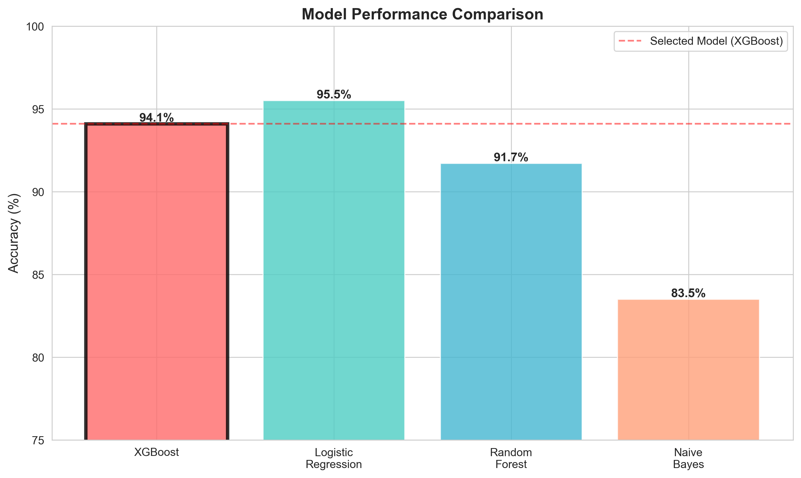
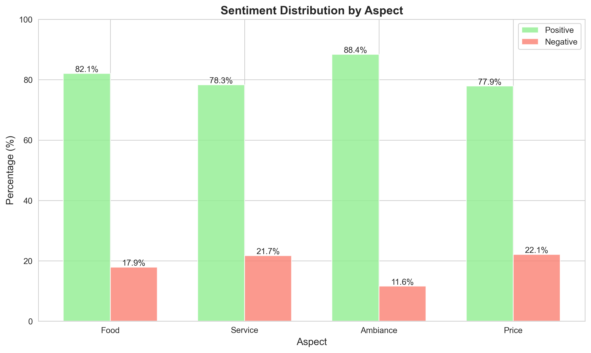
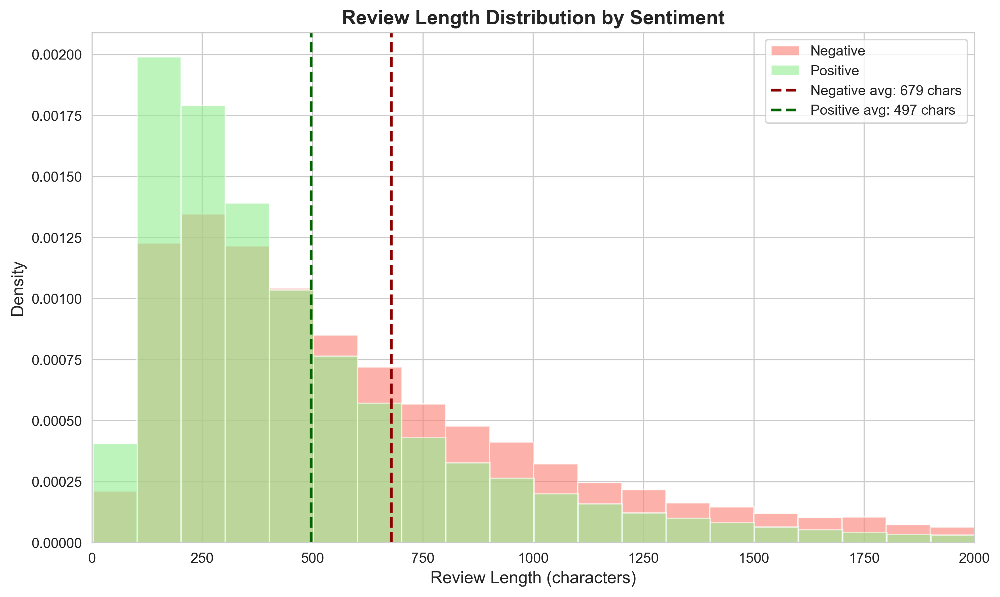

# 🍽️ Restaurant Review Sentiment Analyzer

An AI-powered sentiment analysis tool that classifies restaurant reviews and provides aspect-based insights to help restaurant owners understand customer feedback.

[![Streamlit App] https://restaurant-review-analyzer.streamlit.app/


## 📊 Project Overview

This machine learning project analyzes restaurant reviews to:
- **Classify overall sentiment** (Positive/Negative) with 94.1% accuracy
- **Break down sentiment by aspect**: Food, Service, Ambiance, and Price
- **Provide actionable business insights** for restaurant owners


## 🎯 Key Features

- ✅ **High Accuracy**: 94.1% on 17,728 test reviews
- 🔍 **Aspect-Based Analysis**: Separate sentiment for Food, Service, Ambiance, Price
- 📈 **Business Insights**: Identifies key pain points (Price: 22% negative, Service: 21.7%)
- 🚀 **Production-Ready**: Deployed web application with interactive UI
- 💡 **Smart Context Handling**: Detects contrast words (but, however) for mixed sentiment reviews
- 📊 **Rich Visualizations**: Interactive charts and confidence scores


## 📊 Results & Performance

### Model Comparison



| Model | Accuracy | Recall (Negative) | Use Case |
|-------|----------|-------------------|----------|
| **XGBoost** | **94.1%** | 80.6% | **Best for aspect analysis** ✅ |
| Logistic Regression | 95.5% | 85.9% | Best overall accuracy |
| Random Forest | 91.7% | 65.7% | Slower, lower recall |
| Naive Bayes | 83.5% | 61.5% | Baseline model |

**Selected XGBoost** for superior performance on aspect-level analysis with mixed sentiment, despite slightly lower overall accuracy.

---

### Dataset Overview


Analysis of **88,638 Yelp restaurant reviews**:
- **78.7% Positive** (69,729 reviews)
- **21.3% Negative** (18,909 reviews)
- **Training Set**: 70,910 reviews (80%)
- **Test Set**: 17,728 reviews (20%)

---

### Key Business Insights



**Aspect Analysis Results** (10,000 reviews analyzed):

| Aspect | Positive | Negative | Total Mentions |
|--------|----------|----------|----------------|
| 🍕 Food | 82.1% | 17.9% | 6,686 reviews |
| 👥 Service | 78.3% | 21.7% | 5,815 reviews |
| 🏠 Ambiance | 88.4% | 11.6% | 2,571 reviews |
| 💰 Price | 77.9% | 22.1% | 3,257 reviews |


### Review Length Analysis



**Key Finding**: Negative reviews are **36.6% longer** on average
- ❌ **Negative**: 679 characters (detailed complaints)
- ✅ **Positive**: 497 characters (brief praise)

**Insight**: Customers write more when dissatisfied. Long reviews should be prioritized for monitoring as they're more likely to contain detailed complaints.

---

## 🛠️ Technical Stack

**Languages & Libraries:**
- Python 3.8+
- pandas, NumPy (data processing)
- scikit-learn (TF-IDF, Logistic Regression)
- XGBoost (gradient boosting)
- Matplotlib, Seaborn (visualization)
- Streamlit (web application)

**Machine Learning Pipeline:**
1. Data preprocessing & cleaning (100K → 88K reviews)
2. Feature engineering (TF-IDF + 6 text statistics)
3. Model training & comparison (4 algorithms tested)
4. Aspect extraction with contrast word detection
5. Model serialization & deployment

**Features:** 5,006 total
- 5,000 TF-IDF features (top words/bigrams)
- 6 engineered features: text length, word count, exclamation marks, question marks, capital ratio, avg word length

---

## 📂 Project Structure
```
restaurant-review-analyzer/
├── images/                              
│   ├── sentiment_distribution.png
│   ├── review_length_distribution.png
│   ├── aspect_sentiment_distribution.png
│   └── model_comparison.png
├── data/                      
├── notebooks/                 
│   └── 01_data_exploration.ipynb
├── models/                    
│   ├── xgboost_model.pkl
│   ├── tfidf_vectorizer.pkl
│   ├── aspect_keywords.pkl
│   └── model_metadata.pkl
├── app.py
├── requirements.txt
└── README.md


## 💻 How It Works

### 1. Data Preprocessing
- Loaded 100,000 Yelp restaurant reviews
- Filtered to binary sentiment (removed neutral 3-star reviews)
- Final dataset: 88,638 reviews (70,910 train / 17,728 test)

### 2. Feature Engineering
**TF-IDF Vectorization:**
- Extracted top 5,000 words/bigrams
- Parameters: `min_df=5, max_df=0.8, ngram_range=(1,2)`
- Captures phrases like "not good" vs individual words

**Additional Features:**
- Text length, word count
- Exclamation/question mark counts
- Capital letter ratio
- Average word length

### 3. Aspect-Based Analysis
Extracts sentiment for each aspect by:
1. Identifying sentences mentioning aspect keywords
2. Detecting contrast words ("but", "however") to split mixed sentiment
3. Analyzing isolated context around each aspect
4. Predicting sentiment with confidence scores

**Example:**
> "Food was amazing **but** service was really slow"
- **Food:** POSITIVE (91% confidence)
- **Service:** NEGATIVE (66% confidence)

### 4. Model Training
- Compared 4 algorithms (Logistic Regression, XGBoost, Random Forest, Naive Bayes)
- Used 80/20 train-test split with stratification
- Validated with confusion matrix, precision, recall, F1-score
- Selected XGBoost for production deployment

---

## 🔍 Model Insights

### What Works Well ✅
- High accuracy on clear positive/negative reviews
- Effective aspect separation with contrast words
- Robust handling of common restaurant terminology
- Fast inference (<1 second per review)

### Known Limitations ⚠️
- Struggles with slang terms not in training data (e.g., "sucks", "lit")
- Short phrases (<10 words) have lower accuracy
- Sarcasm detection limited
- Context-dependent sentiment may be misclassified

### Future Improvements 🔮
- **BERT/Transformers**: For better context understanding
- **Expanded Training Data**: Include more informal language and slang
- **Aspect-Level Labels**: Train on data with aspect-specific annotations
- **Multi-Language Support**: Extend beyond English reviews
- **Time-Series Analysis**: Track sentiment trends over time

---

## 📊 Dataset

**Source:** Yelp Open Dataset  
**Size:** 100,000 reviews → 88,638 after filtering  
**Split:** 80% train (70,910) / 20% test (17,728)  
**Features:** Review text, star rating (1-5), date, business ID

**Preprocessing:**
- Removed 3-star reviews (neutral sentiment)
- Binary labels: 1-2 stars → Negative, 4-5 stars → Positive
- Class distribution: 78.7% positive, 21.3% negative

---

## 👩‍💻 Author

**Irina Vertiagina**

- 📧 Email: ivertiagina@oakland.edu
- 💼 LinkedIn: [Irina Vertiagina](https://www.linkedin.com/in/irina-vertiagina)
- 🐙 GitHub: [@IrinaVertiagina-hub](https://github.com/IrinaVertiagina-hub)

